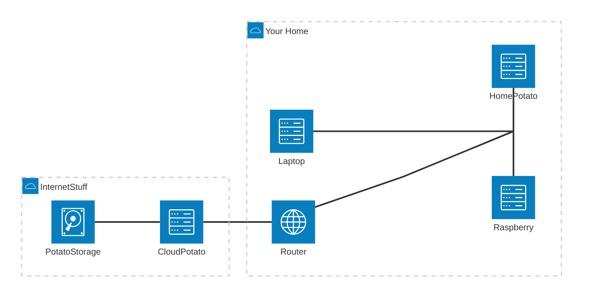

# Important info first

- i document stuff i tend to forget if XY happens less frequent.


# Overview

- Tried the experimental [Mermaid-Architecture Graph](https://mermaid.js.org/syntax/architecture.html) (as of July 25 - still beta).
- depending on mermaid version might look goofy...



## SSH-Stuff

### Do Stuff from your _Laptop_

The _Laptop_, in this case, is the main-device i am/you are working from.

#### 1. Create a SSH-key on your _Laptop_

```shell
ssh-keygen
```
- Generates 2 Files in the Folder `~/.ssh/`. 
  - With a RegEx-Expression like that `(?<public_key>(?<private_key>^.*)\.pub$)`
    - e.g. 'id_abc123' and 'id_abc123.pub'
- maybe something like `ls | grep --regexp="(?<public_key>(?<private_key>^.*)\.pub$) | ???` is possible?
  - not worth the effort to automate... 

#### 2. Set file-permissions on your _Laptop_

```shell
chmod 700 ~/.ssh
chmod 600 ~/.ssh/id_abc123
chmod 644 ~/.ssh/id_abc123.pub
```

<details>
<summary><strong>NOTE: Additional Infos about permissons stuff i always tend to forget...</strong></summary>

Because i tend to forget that aswell...
all those permissions can be set for users, groups or others
- user = owns the file (can be anyone)
- group = member of group (can be any user)
- others = neither user, nor member of group
- there is a 4th bit, but i dont know what it does or what it is good for -> i dont use it.


 |permisson             |number|rwx|
 |----------------------|------|---|
 | read, write, execute | 7    |rwx|
 | read, write          | 6    |rw-|
 | read,        execute | 5    |r-x|
 | read,                | 4    |r--|
 |       write, execure | 3    |-wx|
 |       write,         | 2    |-w-|
 |              execute | 1    |--x|
 |                      | 0    |---| 

 |      |user |group  |others| text-explanation                                                                        |
 |------|-----|-------|------|-----------------------------------------------------------------------------------------|
 |chmod |7    |0      |0     | users can read, write and execute. groups can do nothing. others can do nothing         |
 |chmod |6    |0      |0     | users can read and write, but not execute. groups can do nothing. others can do nothing |
 |chmod |6    |4      |4     | users can read and write, but not execute. groups can read. others can read             |
 </details>

This should do the trick, which is eventually necessary. at least for me it is...
 
#### 3. Send ssh-key from _Laptop_ to _Potato_

```shell
ssh-copy-id {potato_user}@{home_potato}
```

The happy path is that you have to enter the password for _potato_user_ once (and never again - and the "never again"-thingy is why it s always annoying to do exactly that!)
Rince and repeat for all of your potatos

#### 4. Login into _Potato_ from _Laptop_

```shell
ssh {potato_user}@{home_potato}
```

The happy path is that you are logged into your _potato_ without password.

## Docker-Stuff

to be done

### Do stuff from your _Laptop_

lorem ipsum

#### vs code on your _Laptop_

lorem ipsum

#### docker on your _Laptop_

lorem ipsum

#### docker context with _potato_user_ on _potato_

lorem ipsum

#### docker context with different users on _potato_

lorem ipsum
